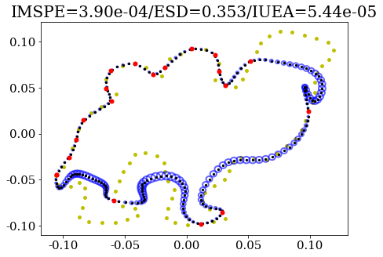

# multishapeGP: Multiple-output Gaussian process (GP) nonparametric models for closed curves with statistical shape analysis applications

## **Copyright notice**

© 2023. Triad National Security, LLC. All rights reserved.
This program was produced under U.S. Government contract 89233218CNA000001 for Los Alamos
National Laboratory (LANL), which is operated by Triad National Security, LLC for the U.S.
Department of Energy/National Nuclear Security Administration. All rights in the program are.
reserved by Triad National Security, LLC, and the U.S. Department of Energy/National Nuclear
Security Administration. The Government is granted for itself and others acting on its behalf a
nonexclusive, paid-up, irrevocable worldwide license in this material to reproduce, prepare.
derivative works, distribute copies to the public, perform publicly and display publicly, and to permit.
others to do so.

## **Content**

This is the code repository associated with the research publication "Nonparametric Multi-shape Modeling with Uncertainty Quantification" by [Hengrui Luo](https://hrluo.github.io/) and [Justin D. Strait](https://scholar.google.com/citations?user=amZk5V4AAAAJ&hl=en). The pre-print for this paper can be accessed at (https://arxiv.org/abs/2206.09127).

- **What does this code do?**
This code performs multiple-output Gaussian process (GP) fitting for closed curve datasets. The model assumes that each closed curve (including the case of a single curve) is realized as a collection of points, assumed to be drawn from its own unknown, underlying closed curve; the GP model is used to estimate each curve (in $\mathbb{R}^d$, with primary focus on $d=2$), both in terms of a mean function attached with corresponding pointwise uncertainties. Our code is capable of fitting smooth closed curves for point sets that are noisy or assumed noise-free, as well as sparse or dense (high-dimensional) number of points. Default options produce smooth fits, with numerous user-specified options capable of modifying the GP kernel to achieve the desired curve smoothness. The code is also capable of fitting closed curves coming from multiple classes (e.g., point sets representing the outlines of different leaf types).

- **Why use a multiple-output Gaussian process model for closed-curve fitting?**  
    - It is a nonparametric model-based approach, which is robust to modeling assumptions compared to parametric modeling.
    - Furthermore, model-based approaches allow tractable uncertainty quantification (UQ), in contrast to many model-free approaches for curve fitting and statistical shape analysis. Uncertainties can be propagated forward to downstream statistical tasks, which are commonly of interest in statistical shape analysis.
    - The model ensures that the fitted curve is indeed closed, in contrast to standard application of common functional data or spline-based models which do not guarantee curve closure (which we call consistency).
    - The model also appropriately characterizes the multi-level dependence structure inherent in a collection of closed curves: (i) within-curve dependence between points, (ii) within-curve dependence between x and y-coordinate functions, and (iii) in the presence of multiple curves, between-curve dependence. This allows curve fitting to exploit structural similarities, both within-curve and between-curve, which is particularly important if curves are observed as sparse samples. Furthermore, if curves are divided into multiple classes, we also account for within-class dependence of curves.
    
- **What are some downstream statistical shape analysis tasks that can exploit our multiple-output Gaussian process model?**
In our example script and manuscript, we demonstrate that our multiple-output GP model for closed-curve fitting has substantial benefits for the following common tasks in statistical shape analysis, with notable performance improvements when curves are fit based on point sets which are sparse and potentially with additive noise.
    - **Curve reconstruction:** The multi-level dependence structure in our model can be used to reconstruct closed curves by borrowing information from other curves to predict/extrapolate regions along curves which are missing or are sparsely observed.
    - **Curve/shape registration:** Given a pair of curves, shape registration aligns curves by removing translation, scale, rotation, and re-parameterization variability (the latter in the case of elastic shape), thus allowing direct comparison of the the shapes of these curves. Our model allows more stable registration when curves are observed sparsely and/or with noise.
    - **Robust shape averaging:** Combined with curve registration, the estimated smooth closed curve fits can be used to obtain more robust summaries of shape centrality (e.g., a more robust "average shape"), particularly for sparsely-sampled curves with noise.
    - **Landmark selection:** Researchers often desire low-dimensional point sets representing the shape of a closed curve (typically known as landmarks). Our model provides an uncertainty-guided approach to estimating landmark locations given curve fits. This estimation can be performed sequentially or simultaneously, based on criterion measuring approximation quality or uncertainty.
    - **Sub-population modeling**: As mentioned above, our model uses coregionalization kernels in the presence of closed curves belonging to multiple classes (with known class labels).

  

- **Implementation.** The code ['multishapeGP'] is implemented within Python, primarily requiring the modules [`GPFlow2`](https://github.com/GPflow/GPflow) and [`fdasrsf`](https://github.com/jdtuck/fdasrsf_python).

## **Usage**

This repository includes the following Python scripts containing an assortment of functions needed to fit single-output and multiple-output GP models for closed curve data, along with helper functions to perform downstream statistical shape analysis tasks (such as landmarking) as well as to assist in mapping between a curve and its arc-length parameterization:

- ['curveGP.py']: includes functions to fit single-output and multiple-output GPs to either a single or multiple closed curve realizations, with flexible kernel specification
- ['curveGPwithLabel.py']: includes functions to fit multiple-output GPs for labeled closed curve realizations, where labels represent sub-populations/classes
- ['landmarkGP.py']: includes functions to use single-output and multiple-output GP fits for closed curve realizations to perform sequential and simultaneous landmarking
- ['utils.py']: includes functions to map between curve realizations (as (x,y) coordinates) and its arc-length parameterization

To demonstrate use of these functions, we provide a reproducible Jupyter notebook, ['ArxivFigScript.ipynb'], which is also labeled according to the figures within the pre-print that it generates. This notebook makes use of two publicly available datasets:

- **MPEG-7 shape dataset:** available at https://dabi.temple.edu/external/shape/MPEG7/dataset.html, this dataset is provided as closed curve boundaries for various classes of objects extracted from binary images. We include the closed curves in the zipped .npz file ['MPEG7.npz'], with class label identifiers given in ['MPEG_key.txt'].
- **Flavia leaf daataset:** available at https://flavia.sourceforge.net/, this dataset is provided as closed curve boundaries for various classes of plant leaves extracted from their corresponding images. We include the closed curves in the zipped .npz file ['flavia_custom.npz'].

There are three .pkl files included, which are based on saved simulations from the Jupyter notebook: ['lmk_sim.pkl'], ['hyp_list.pkl'], ['hyp_listn.pkl']. These can be generated from running the corresponding cells in the notebook, or directly loaded if interested in saving time (as these simulations are computationally intensive).

## **References**

**Funding**
HL was supported by the Director, Office of Science, of the U.S. Department of Energy under Contract No. DE-AC02-05CH11231.
JS was supported by the Laboratory Directed Research and Development program of Los Alamos National Laboratory under project number 20200065DR.

**Citation**
Please cite our paper using following BibTeX item:

    @article{luostrait_multishapeGP_2022,
        title={Nonparametric Multi-shape Modeling with Uncertainty Quantification},
        author={Hengrui Luo and Justin D. Strait},
        year={2022},
        eprint={2206.01409},
        archivePrefix={arXiv},
        primaryClass={cs.LG}
    }

Thank you again for the interest and please reach out if you have further questions.

## **License information**

This program is Open-Source under the BSD-3 License.
 
Redistribution and use in source and binary forms, with or without modification, are permitted provided that the following conditions are met:
1. Redistributions of source code must retain the above copyright notice, this list of conditions and
the following disclaimer.
 
2. Redistributions in binary form must reproduce the above copyright notice, this list of conditions
and the following disclaimer in the documentation and/or other materials provided with the
distribution.
 
3. Neither the name of the copyright holder nor the names of its contributors may be used to endorse
or promote products derived from this software without specific prior written permission.

THIS SOFTWARE IS PROVIDED BY THE COPYRIGHT HOLDERS AND CONTRIBUTORS "AS
IS" AND ANY EXPRESS OR IMPLIED WARRANTIES, INCLUDING, BUT NOT LIMITED TO, THE
IMPLIED WARRANTIES OF MERCHANTABILITY AND FITNESS FOR A PARTICULAR
PURPOSE ARE DISCLAIMED. IN NO EVENT SHALL THE COPYRIGHT HOLDER OR
CONTRIBUTORS BE LIABLE FOR ANY DIRECT, INDIRECT, INCIDENTAL, SPECIAL,
EXEMPLARY, OR CONSEQUENTIAL DAMAGES (INCLUDING, BUT NOT LIMITED TO,
PROCUREMENT OF SUBSTITUTE GOODS OR SERVICES; LOSS OF USE, DATA, OR PROFITS;
OR BUSINESS INTERRUPTION) HOWEVER CAUSED AND ON ANY THEORY OF LIABILITY,
WHETHER IN CONTRACT, STRICT LIABILITY, OR TORT (INCLUDING NEGLIGENCE OR
OTHERWISE) ARISING IN ANY WAY OUT OF THE USE OF THIS SOFTWARE, EVEN IF
ADVISED OF THE POSSIBILITY OF SUCH DAMAGE.
